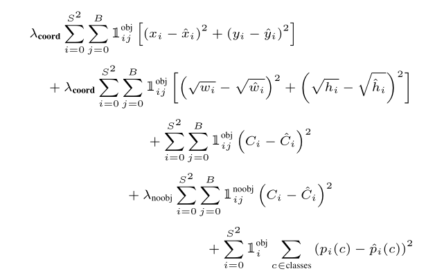

# yolo-from-scratch

An educational implementation of the YOLO (You Only Look Once) object detection algorithm using **TensorFlow + Keras**.  
The goal is to understand *how YOLO works under the hood* by building each component step-by-step, starting with YOLOv1 and extending to YOLOv2.

---

## 📌 Project Goals
- Learn object detection fundamentals by re-implementing YOLO.
- Build a modular TensorFlow/Keras training pipeline:
  - Data loading & preprocessing
  - Target assignment (grid / anchors)
  - Backbone + detection head
  - Custom composite loss
  - Inference with decoding + NMS
  - Evaluation (mAP) and visualization
- Extend from **YOLOv1 → YOLOv2 (YOLO9000)** with anchors, ignore regions, and multi-scale training.

---

## 🗺 Roadmap

### Phase 1: YOLOv1
1. **Dataset & Pipeline**
   - Use Pascal VOC or a small custom dataset.
   - Preprocessing: resize, normalize, augment.
   - Convert labels to YOLO grid format (`S×S×(B*5 + C)`).

2. **Model**
   - Lightweight ConvNet backbone (Conv + BN + LeakyReLU).
   - Detection head with final Conv2D producing `S×S×(B*5 + C)`.

3. **Loss**
   - Box regression (MSE on (x,y), √w, √h).
   - Objectness (positive & negative cells).
   - Class prediction loss (CE/MSE).
   - Tunable weights (λ_coord, λ_noobj).

4. **Training**
   - `model.fit` or custom training loop.
   - Warmup + LR schedule.
   - Monitor separate loss terms.

5. **Inference**
   - Decode predictions to absolute boxes.
   - Confidence = objectness × class probability.
   - Apply NMS for final predictions.

6. **Evaluation & Visualization**
   - Compute **mAP@[0.5]**.
   - Visualize predicted vs ground truth boxes.

---

### Phase 2: YOLOv2 (YOLO9000)
1. Introduce **anchors** (k-means or VOC defaults).
2. Update target assignment (anchor responsibility + ignore IoU threshold).
3. Loss modifications for anchor parameterization (t_x, t_y, t_w, t_h).
4. Add **multi-scale training** (input sizes 320–608).
5. Strengthen backbone.

---

## ✅ Deliverables
- **Data pipeline** (`tf.data`)
- **YOLOv1 model** (Keras Sequential/Functional API)
- **Custom loss** (composite with masks)
- **Inference decoder + NMS**
- **Training script** (with callbacks, checkpoints, LR schedule)
- **Evaluation script** (mAP, PR curves)
- **Visualization tools** (targets, predictions)

---

## 📅 Suggested Milestones
- **Week 1:** Dataset & targets verified visually.
- **Week 2:** Loss stable, short overfit run on small dataset.
- **Week 3:** End-to-end YOLOv1 training on subset, sanity mAP.
- **Week 4:** Full YOLOv1 training; visualization + metrics.
- **Phase 2:** Add anchors → YOLOv2 features.

---

## ⚠️ Notes & Pitfalls
- Verify target assignment visually before training.
- Loss balancing is critical; tune λ_noobj carefully.
- Monitor box/obj/cls loss separately to catch imbalances.
- Ensure augmentations update boxes consistently.

## Details from You Only Look Once: Unified, Real-Time Object Detection
- We normalize the bounding box width and height by the image width and height so that they fall between 0 and 1.

- We parametrize the bounding box x and y coordinates to be offsets of a particular grid cell location so they are also bounded between 0 and 1.

- DONE We use a linear activation function for the final layer and all other layers use the following leaky rectified linear activation.

- DONE We optimize for sum-squared error in the output of our model.

- We increase the loss from bounding box coordinate predictions and decrease the loss from confidence predictions for boxes that don’t contain objects. 
  - We use two parameters, λ<sub>coord</sub> and λ<sub>noobj</sub> to accomplish this. 
  - We set λ<sub>coord</sub> = 5 and λ<sub>noobj</sub> = .5.

- Sum-squared error also equally weights errors in large boxes and small boxes. Our error metric should reflect that small deviations in large boxes matter less than in small
boxes. 
  - To partially address this we predict the square root of the bounding box width and height instead of the width and height directly.

- During training we optimize the following, multi-part loss function:


- Where: 
  - <i>S</i>: number of grid cells per image side  
  - <i>B</i>: number of bounding boxes per grid cell  
  - λ<sub>coord</sub>, λ<sub>noobj</sub>: weighting terms  
  - C<sub>i</sub>: confidence score  
  - p<sub>i</sub>(c): predicted class probability  

- We train the network for about 135 epochs.

- DONE Throughout training we use a batch size of 64, a momentum of 0.9 and a decay of 0.0005.

- DONE Our learning rate schedule is as follows: 
  - For the first epochs we slowly raise the learning rate from 10<sup>-3</sup> to 10<sup>−2</sup>.
  - We continue training with 10<sup>−2</sup> for 75 epochs, then 10<sup>−3</sup> for 30 epochs, and finally 10<sup>−4</sup> for 30 epochs.

- To avoid overfitting we use dropout and extensive data augmentation. 
- - DONE A dropout layer with rate = .5 after the first connected layer prevents co-adaptation between layers.
- - For data augmentation we introduce random scaling and translations of up to 20% of the original image size. 
- - We also randomly adjust the exposure and saturation of the image by up to a factor of 1.5 in the HSV color space.

---
# 10/13/2025 TODO
A: lr=1e-2, warmup=1k steps, clip=1.0

B: lr=3e-3, warmup=1k, clip=1.0

C: lr=1e-3, warmup=500, clip=1.0

D: lr=3e-4, warmup=0, clip=1.0
Log QUALITY at the end of epoch 3 for each; pick best by val_iou.

---

## 📂 Progress

To generate progress update to README file:

```
python -m scripts.append_latest_quality
git add README.md
git commit -m "Append latest model quality to README"
```

10/12/2025 Commit d6e0c26
Epoch 005 | lr 0.003000 | train nan | val 21029796.0000 | val_iou 0.0000

10/03/2025 Commit 250a082
Epoch 005 | lr 0.003000 | train 288163088862348.5625 | val 30183474069504.0000 | val_iou 0.0000

09/30/2025 Commit c925bf2
NA

09/29/2025 Commit c391711
Epoch 005 | lr 0.003000 | train 0.0263 | val 0.0259 | val_iou 0.3636

09/27/2025 Commit 8561382
Epoch 005 | lr 0.010000 | train 0.0232 | val 0.0138 | val_iou 0.5583

## Progress
10/13/2025 Commit 2b2b228 Epoch 004 | lr 0.000100 | train 1.3799 | val 0.9911 | val_iou 0.2160
10/14/2025 Commit 71e6690 Epoch 004 | lr 0.003000 | train 2.5890 | val 2.4107 | val_iou 0.1234
10/16/2025 Commit e6cd027 Epoch 004 | lr 0.010000 | train 0.0225 | val 0.0135 | val_iou 0.5587
10/16/2025 Commit c49958b Epoch 004 | lr 0.010000 | train 0.0261 | val 0.0141 | val_iou 0.5523
10/18/2025 10/18/2025 Commit f06afb5 Epoch 010 | lr 0.010000 | train 0.0476 | val 0.0254 | val_iou 0.6093
10/18/2025 Commit a9e7477 Epoch 012 | lr 0.010000 | train 0.0564 | val 0.0255 | val_iou 0.6033
10/18/2025 Commit 96cf66a Epoch 034 | lr 0.010000 | train 0.0502 | val 0.0254 | val_iou 0.5984
10/19/2025 Commit b98748a Epoch 057 | lr 0.002710 | train 0.0416 | val 0.0308 | val_iou 0.5129
10/19/2025 Commit 1aa992a Epoch 012 | lr 0.010000 | train 0.0535 | val 0.0257 | val_iou 0.6041
10/19/2025 Commit 2714a91 Epoch 011 | lr 0.010000 | train 1.2425 | val 0.6871 | val_iou 0.6642
10/21/2025 Commit a3720e1 Epoch 008 | lr 0.010000 | train 1.1224 | val 1.0258 | val_iou 0.4823
10/19/2025 Commit 2714a91 Epoch 011 | lr 0.010000 | train 1.2425 | val 0.6871 | val_iou 0.6642
10/21/2025 10/21/2025 Commit 59599cd Epoch 009 | lr 0.010000 | train 1.4127 | val 1.5773 | val_iou 0.5051
